# Pager

Pager is an all in one android app for browsing and reviewing books and sharing your thoughts with your friends, or the world!
## Goals for major milestones
### `Version 0.1.0 "Footnote"`

| Feature                                                                                                    | Screenshots                                                                                                                             |
|------------------------------------------------------------------------------------------------------------|-----------------------------------------------------------------------------------------------------------------------------------------|
| The ability to add books to diary by manually typing the name and author, and giving your optional review. | <table><tr><td>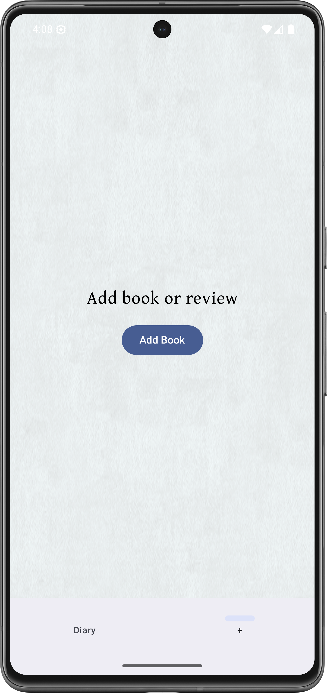</td><td>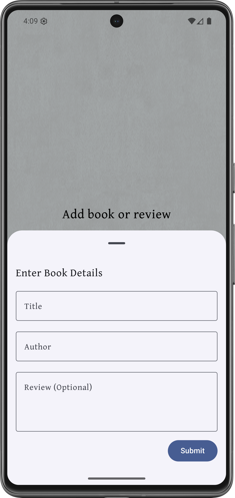</td></tr></table> |
| The ability to view all your books and reviews from the diary page, ordered by date reviewed.              | 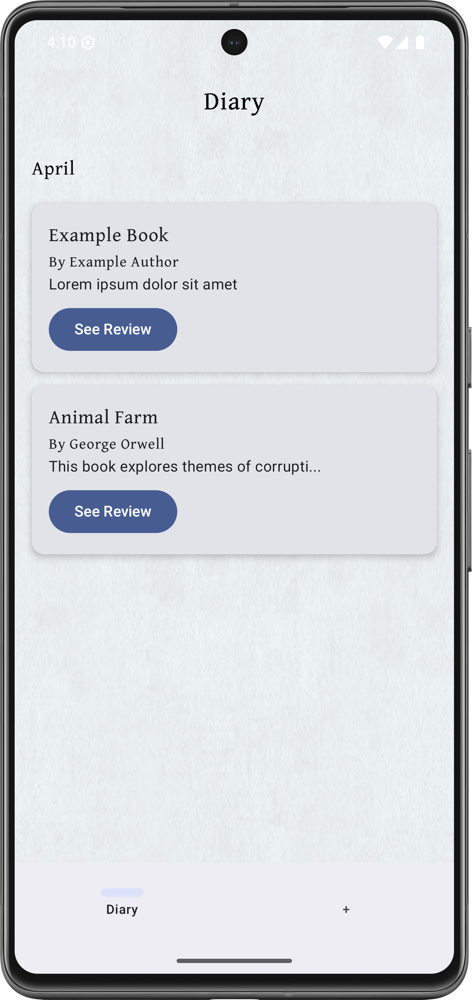                                                                              |

### `Version 0.2.0 "Alexandria"`

| Feature                                                                     | Screenshots                                                                                                                                                         |
|-----------------------------------------------------------------------------|---------------------------------------------------------------------------------------------------------------------------------------------------------------------|
| The ability to add books to diary by searching for them using an online API | <table><tr><td>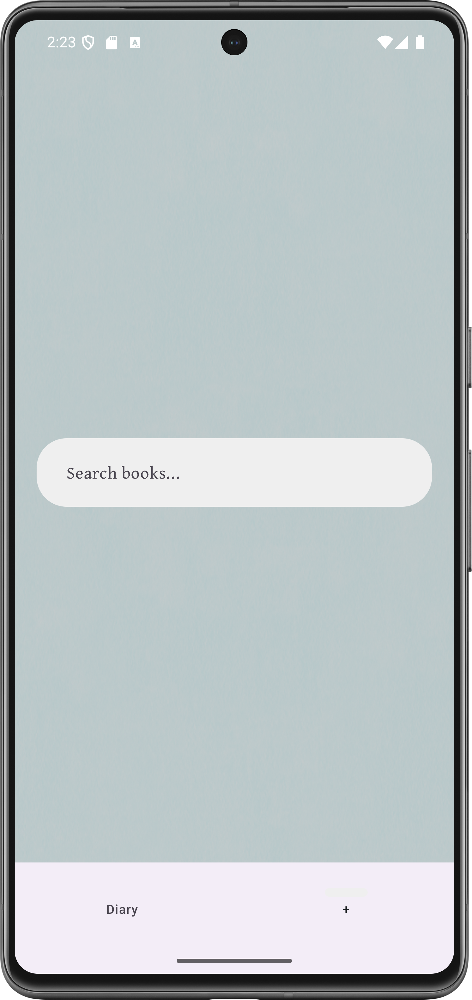</td><td>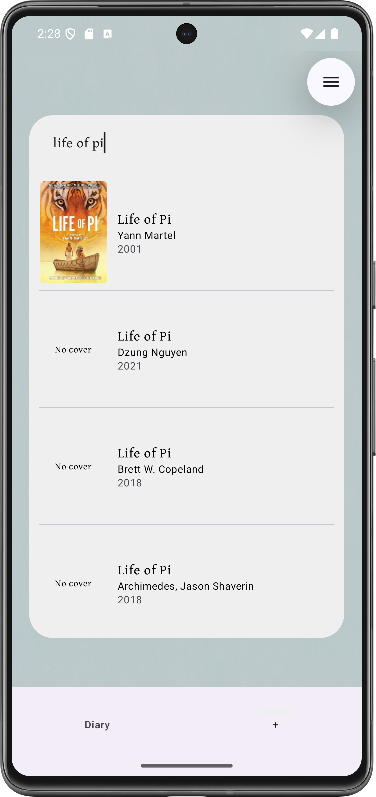</td></tr></table> |
| The ability to rate books from 1 - 10                                       | 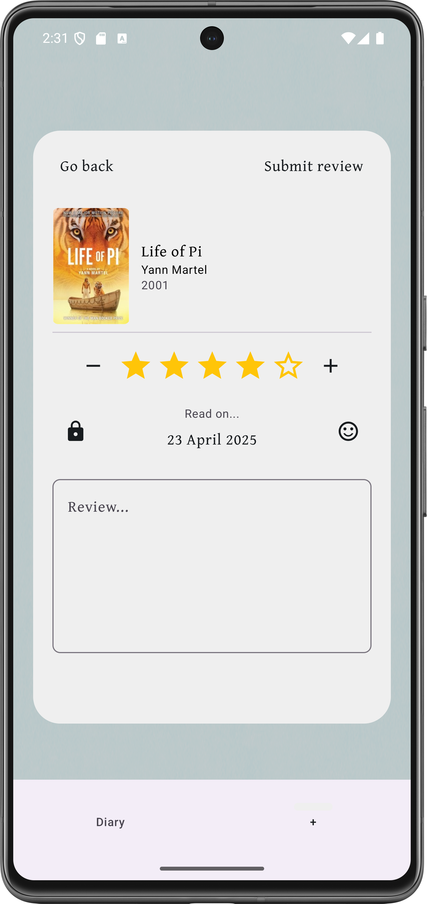                                                                                                       |
| The ability to mark reviews for spoilers                                    | 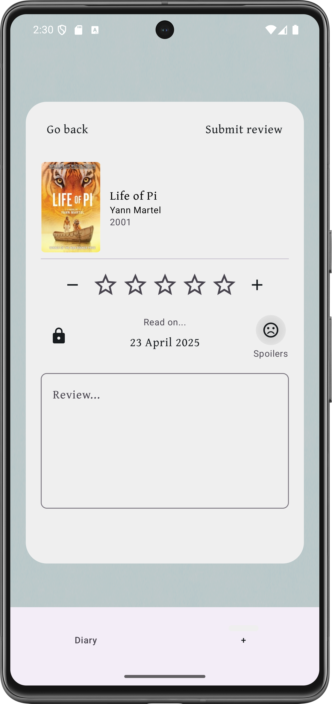                                                                                                     |
| The ability to mark reviews as public, just friends, or private             | 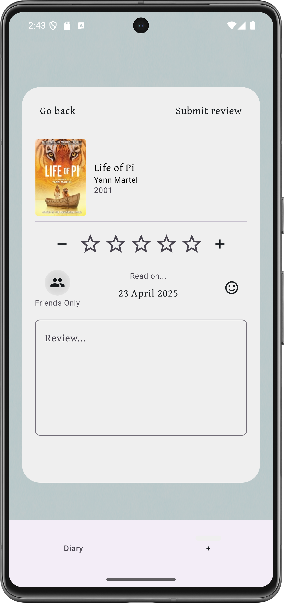                                                                                                    |
| The ability to mark any date as the date read                               | 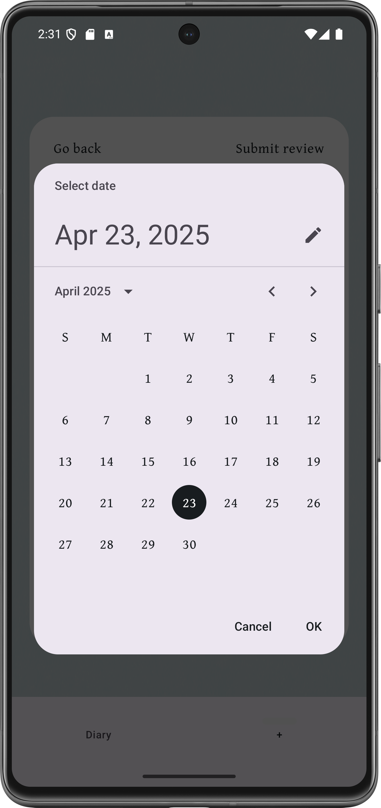                                                                                                         |
| The ability to see book covers in diary                                     | 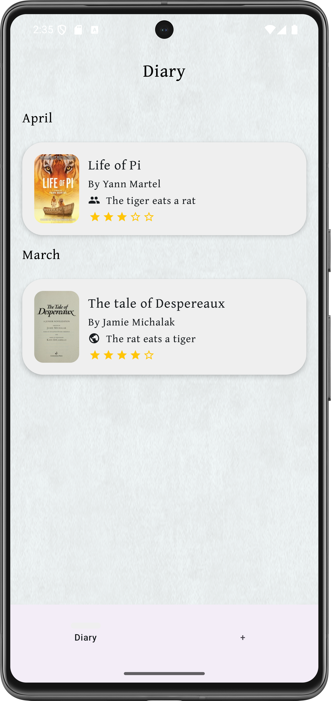                                                                                                        |
| The ability to delete reviews                                               |                                                                                                        |
| The ability to edit review text, publicity, rating, and spoilers            | 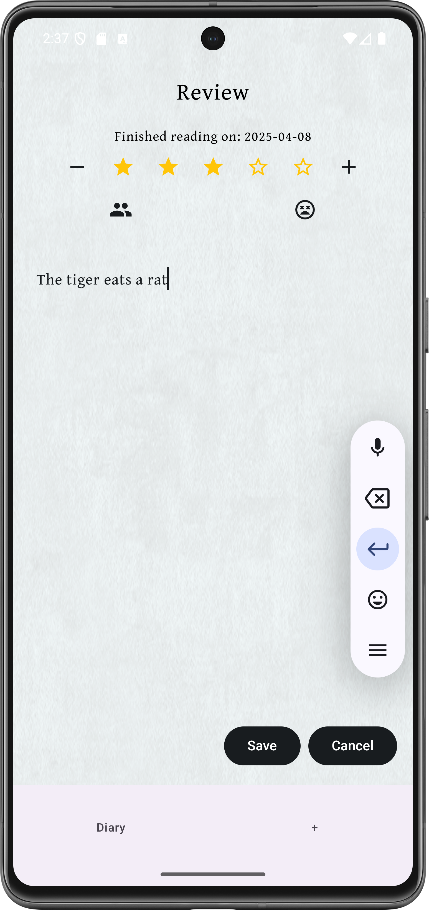                                                                                                         |

### `Version 0.3.0 "Housekeeping"`
- Development
  - Code style
    - Integrate ktlint
    - Configure auto formatting with gradle task
  - Code coverage
    - Set up JaCoCo for unit test coverage
  - Testing
    - Implement JUnit 5 for unit testing
    - Use MockK for mocking dependencies
    - Add basic test coverage
  - Structure & Code Quality
    - Modularize code
    - Refactor and clean up code
  - CI/CD
    - Set up Github Actions to automate:
      - Lint checks
      - Unit tests
      - Coverage Reporting
  - Disable landscape mode

### `Version 0.4.0 "Voltaire"`

| Feature                                                                         | Screenshots                                                                                                                                                        |
|---------------------------------------------------------------------------------|--------------------------------------------------------------------------------------------------------------------------------------------------------------------|
| The ability to view books in a carousel, with their quotes below                |                                                                                                     |
| The ability to add quotes by writing them with optional page number             | 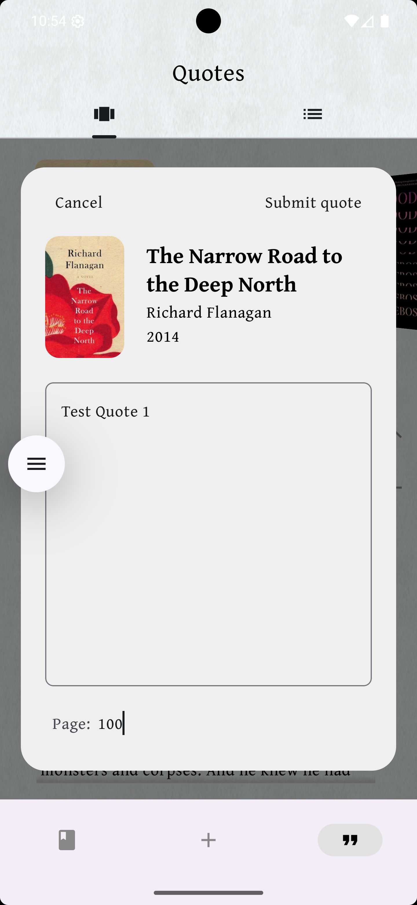                                                                                                  |
| The ability to view all quotes in one scrollable page                           | 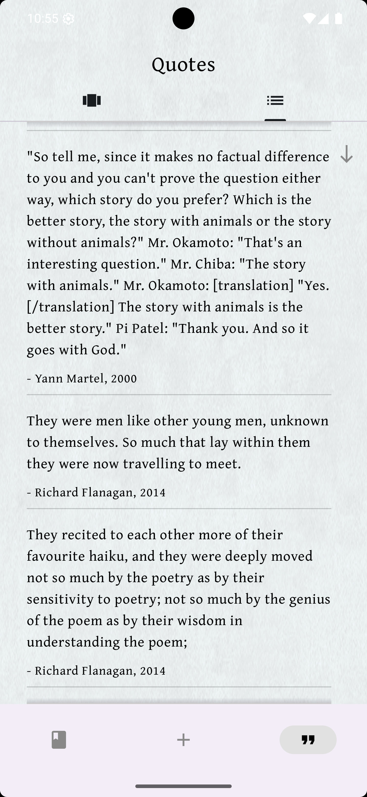                                                                                                   |
| The ability to take a picture of the page, scan for text, and select your quote | <table><tr><td></td><td></td></tr></table> |
| The ability to trim the selected text to your quote and edit it afterwards      | 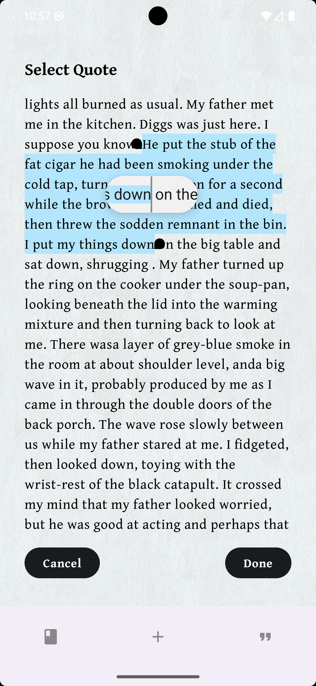                                                                                                   |

### `Version 0.5.0 "Binding"`
- Firebase
  - Move db to firebase
  - The ability to login, log out, and delete all data
  - The ability to be logged in and synced across multiple devices
- Settings
  - Will add a settings page
  - The ability to set preferences
- Customization
  - The ability to change theme
  - The ability to change the layout of the diary

### `Version 1.0.0 "Bookworm"`
- View books
  - The ability to sort diary by date reviewed, rating, title, name of author, and date published.
- Search
  - The ability to do a general search of books, and view all their information
- UI
  - Fully polished User Interface
  - Full dark mode integration

### `Version 2.0.0 "Book Club"`
- Online 
  - The ability to share your reviews with friends and the world
  - The ability to follow other users and see their reviews
      - Others reviews with spoilers will be hidden and revealed by button press
  - The ability to comment on other users reviews
  - The ability to like other users reviews
  - The ability to "Recommend" books to people, and have it show on their device
- Explore
  - The explore page will show books your friends like, recommended books, etc
- Notifications
  - The ability to receive notifications about friends, comments etc

## Possible feature ideas
#### Book calendar
#### Statistics page
## Contact me
Email: Lukew2048@gmail.com
