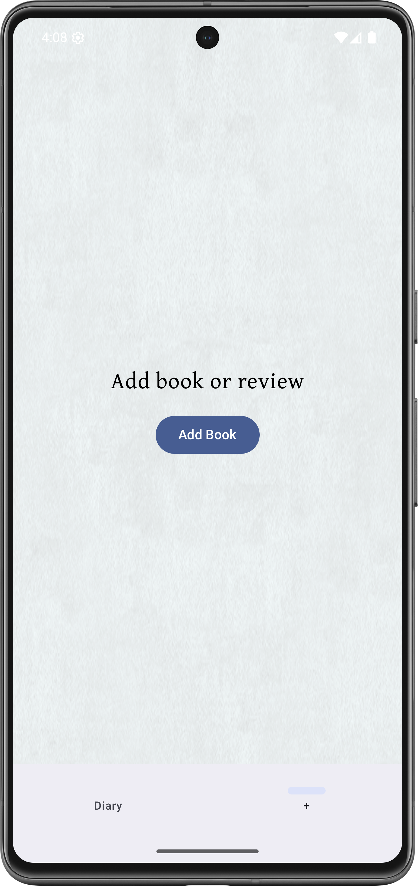
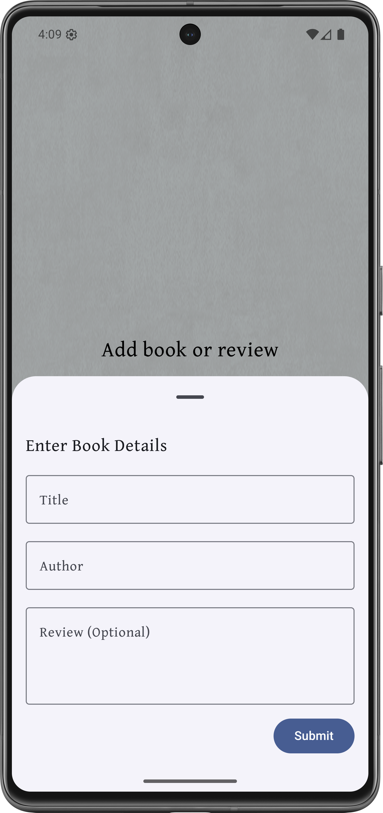
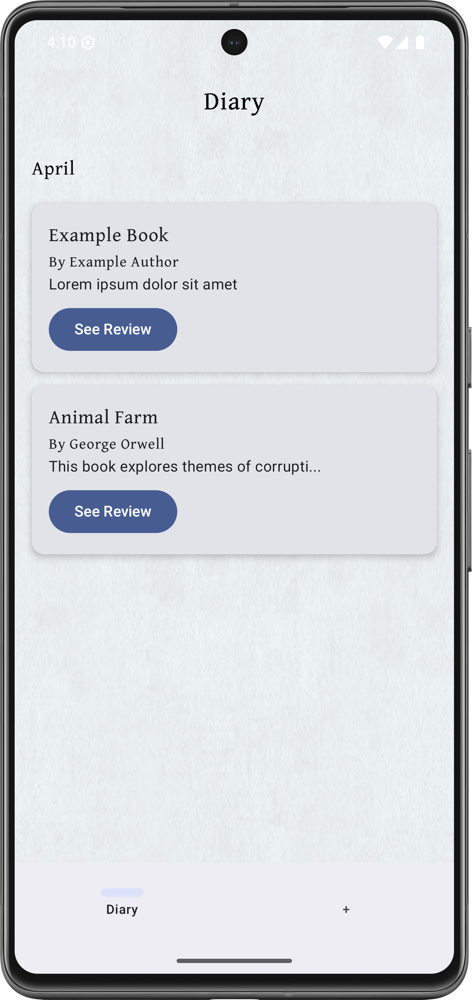

# Pager

Pager is an all in one android app for browsing and reviewing books and sharing your thoughts with your friends, or the world!
## Goals for major milestones
### `Version 0.1.0 "Footnote"`
- Add books
  - The ability to add books to diary by manually typing the name and author, and giving your optional review.
    
    
- View books
  - The ability to view all your books and reviews from the diary page, ordered by date reviewed.

    
### `Version 0.2.0 "Alexandria"`
- Add books
  - The ability to add books to diary by searching for them using an online API.
  - The ability to rate books from 1 - 10
  - The ability to mark reviews for spoilers
  - The ability to mark reviews as public, just friends, or private
  - The ability to mark any date as the date read
- View books
  - The ability to see book covers in diary
  - The ability to delete reviews
  - The ability to edit review text, publicity, rating, and spoilers
### `Version 0.2.1 "Housekeeping"`
- Development
  - Code style
    - Integrate ktlint
    - Configure auto formatting with gradle task
  - Code coverage
    - Set up JaCoCo for unit test coverage
  - Testing
    - Implement JUnit 5 for unit testing
    - Use MockK for mocking dependencies
    - Add basic test coverage
  - Structure & Code Quality
    - Modularize code
    - Refactor and clean up code
  - CI/CD
    - Set up Github Actions to automate:
      - Lint checks
      - Unit tests
      - Coverage Reporting
### `Version 1.0.0 "Bookworm"`
- View books
    - The ability to sort diary by date reviewed, rating, title, name of author, and date published.
- Quotes
    - The ability to add quotes for your books
    - The ability to view a carousel of all your books and their quotes
- Search
    - The ability to do a general search of books, and view all their information
- UI
    - Fully polished User Interface
    - Full dark mode integration
- Settings
    - Will have a settings page
    - The ability to change theme
    - The ability to set preferences
### `Version 2.0.0 "Book Club"`
- Online 
  - The ability to share your reviews with friends and the world
  - The ability to follow other users and see their reviews
      - Others reviews with spoilers will be hidden and revealed by button press
  - The ability to comment on other users reviews
  - The ability to like other users reviews
- Explore
    - The explore page will show books your friends like, recommended books, etc

## Possible feature ideas
#### Book calendar
#### Statistics page
#### 
## Contact me
Email: Lukew2048@gmail.com
